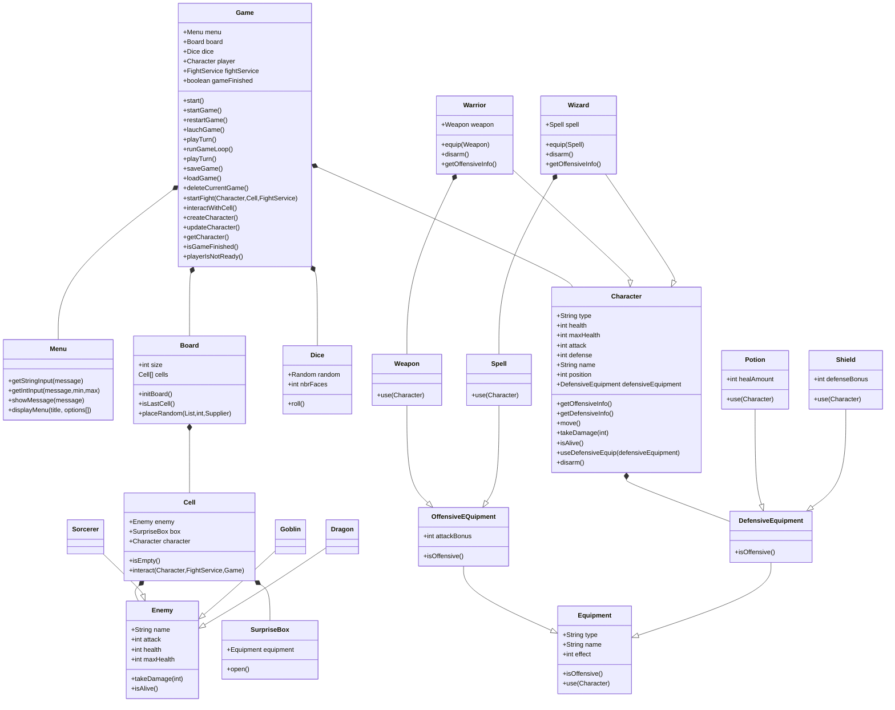

# 🎮 DnD Game

Un jeu de rôle Donjon & Dragon en Java où vous dirigez un personnage dans des aventures épiques dans votre invit de commande.

---

## 🚀 Lancement du jeu

### Prérequis

- JDK Java SE 17 (LTS)
- Un IDE Java (IntelliJ IDEA, Eclipse, etc.) ou compilateur Java
- MySQL 8.0 ou supérieur

### Configuration de la base de données

1. **Créer une base de données MySQL vide**

   ```sql
   CREATE DATABASE dndgame;
   ```

2. **Configurer le fichier de connexion**

   Créez le fichier `src/resources/db.properties` avec vos informations de connexion :

   ```properties
   db.url=jdbc:mysql://localhost:3306/dndgame
   db.user=user
   db.pass=password
   ```

   > ⚠️ Ne commitez pas ce fichier si votre projet est public. Ajoutez-le à votre `.gitignore`.

3. **Les tables sont créées automatiquement** au premier lancement via `DatabaseInitializer`.

### Instructions

1. **Cloner ou ouvrir le projet**

   ```bash
   cd DnDGame
   ```

2. **Compiler le projet**

   ```bash
   javac -d out src/fr/campus/dndgame/**/*.java
   ```

3. **Lancer le jeu**
   ```bash
   java -cp out fr.campus.dndgame.main.Main
   ```

Ou directement depuis votre IDE, lancez la classe `Main.java`.

---

### Générer la Javadoc

Pour générer la documentation Javadoc du projet :

```bash
javadoc -d docs/javadoc -sourcepath src fr.campus.dndgame fr.campus.dndgame.main.model.board fr.campus.dndgame.main.model.characters fr.campus.dndgame.main.model.enemies fr.campus.dndgame.main.model.equipments fr.campus.dndgame.main.game fr.campus.dndgame.main.utils
```

Cela crée un dossier `docs/javadoc` contenant la documentation HTML. Ouvrez `docs/javadoc/index.html` dans votre navigateur pour consulter la documentation.

---

## ✨ Fonctionnalités

### 🎭 Créations de personnages

- **Warrior** : Combattant robuste avec endurance élevée
  - Santé : 10
  - Attaque : 5
  - Possibilité d'équiper une arme
- **Wizard** : Magicien puissant basé sur la magie
  - Santé : 6
  - Attaque : 8
  - Possibilité d'équiper un sort

### ⚔️ Système de combat

- Affrontements contre différents ennemis :
  - Gobelin
  - Dragon
  - Sorcier

### 🎒 Équipements

- **Armes** : Augmentent les dégâts réservées au Warrior
- **Sorts** : Capacités spéciales pour les wizards
- **Potions** : Récupération de santé
- **Shields** : Reduction de dommage 

### 🗺️ Plateau de jeu

- Déplacement sur un plateau
- Exploration de cellules
- Rencontres aléatoires

### 🎲 Mécanique de hasard

- Système de dés : Défini le déplacement du joueur & Coup Critique / Echec Critique lors de combats
- Boîte surprise avec récompenses aléatoires

---

## 📋 Structure du projet

```
src/fr/campus/dndgame/
├── main/
│   ├── Main.java                 # Point d'entrée du jeu
│   ├── dao/                      # Accès aux données
│   ├── db/                       # Connexion base de données
│   ├── factory/                  # Patterns factory
│   ├── game/                     # Logique principale du jeu
│   ├── model/
│   │   ├── board/                # Plateau de jeu
│   │   ├── characters/           # Classes de personnages
│   │   ├── enemies/              # Classes d'ennemis
│   │   └── equipments/           # Système d'équipements
│   └── utils/                    # Utilitaires (menu, dés, etc.)
│── test/                         # Tests unitaires
└── resources/
    └── db.properties             # Configuration BDD (à créer, ne pas commiter)
```

---

## 📊 Diagramme UML



---

**Amusez-vous bien dans votre aventure ! 🗡️✨**
