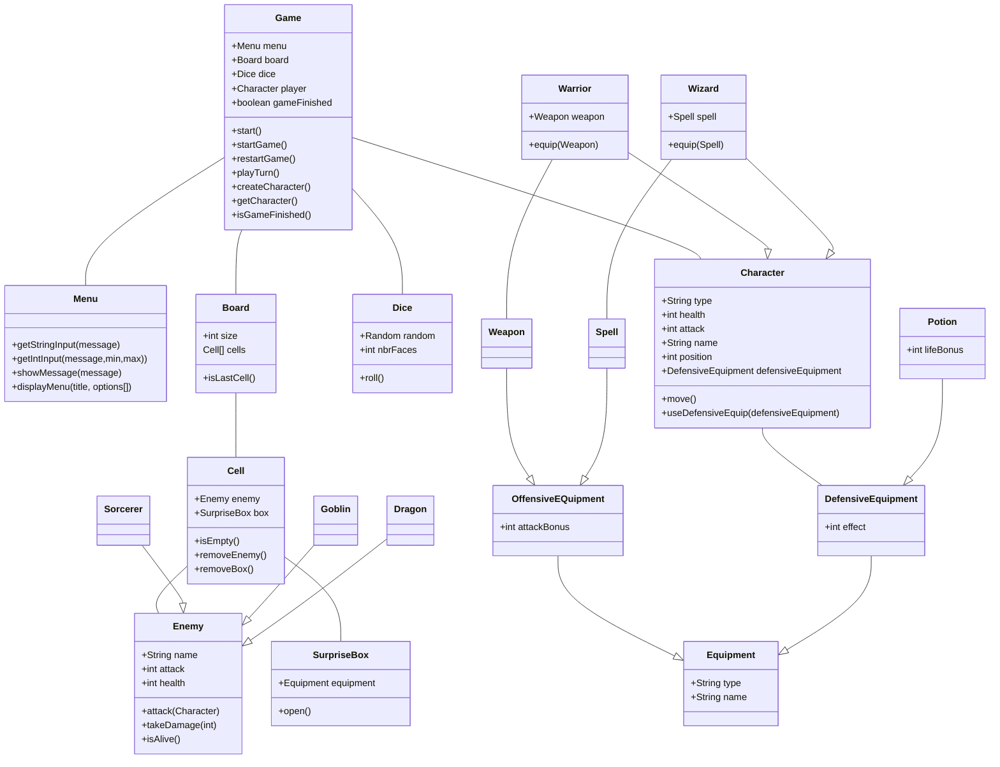

# 🎮 DnD Game

Un jeu de rôle Donjon & Dragon en Java où vous dirigez un personnage dans des aventures épiques dans votre invit de commande.

---

## 🚀 Lancement du jeu

### Prérequis

- Java 11 ou supérieur
- Un IDE Java (IntelliJ IDEA, Eclipse, etc.) ou compilateur Java

### Instructions

1. **Cloner ou ouvrir le projet**

   ```bash
   cd DnDGame
   ```

2. **Compiler le projet**

   ```bash
   javac -d out src/fr/campus/dndgame/**/*.java
   ```

3. **Lancer le jeu**
   ```bash
   java -cp out fr.campus.dndgame.Main
   ```

Ou directement depuis votre IDE, lancez la classe `Main.java`.

---

## ✨ Fonctionnalités

### 🎭 Créations de personnages

- **Warrior** : Combattant robuste avec endurance élevée
  - Santé : 10
  - Attaque : 5
  - Possibilité d'équiper une arme
- **Wizard** : Magicien puissant basé sur la magie
  - Santé : 6
  - Attaque : 8
  - Possibilité d'équiper un sort

### ⚔️ Système de combat

- Affrontements contre différents ennemis :
  - Gobelin
  - Dragon
  - Sorcier

### 🎒 Équipements

- **Armes** : Augmentent les dégâts réservées au Warrior
- **Sorts** : Capacités spéciales pour les wizards
- **Potions** : Récupération de santé

### 🗺️ Plateau de jeu

- Déplacement sur un plateau
- Exploration de cellules
- Rencontres aléatoires

### 🎲 Mécanique de hasard

- Système de dés pour les probabilités
- Boîte surprise avec récompenses aléatoires

---

## 📋 Structure du projet

```
src/fr/campus/dndgame/
├── Main.java                 # Point d'entrée du jeu
├── characters/               # Classes de personnages
├── enemies/                  # Classes d'ennemis
├── equipments/               # Système d'équipements
├── board/                    # Plateau de jeu
├── game/                     # Logique principale du jeu
└── utils/                    # Utilitaires (menu, dés, etc.)
```

---



---

**Amusez-vous bien dans votre aventure ! 🗡️✨**
